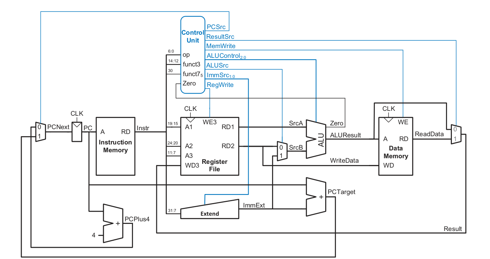
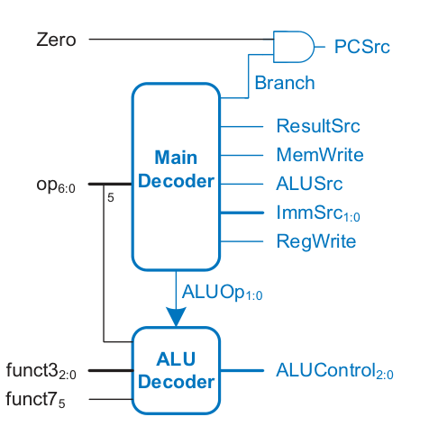

# RISC-V RV32I Single-Cycle Processor

A clean, modular implementation of a 32-bit single-cycle RISC-V processor core supporting the base integer instruction set ($\text{RV32I}$), developed in SystemVerilog.

> *Note: The core architecture and datapath design have been adapted from **Digital Design and Computer Architecture: RISC-V Edition** by David Harris and Sarah Harris.*

## 🏛️ System Architecture

This core implements a classic single-cycle datapath where every instruction executes within a single clock cycle. It integrates core functional units including an Arithmetic Logic Unit ($\text{ALU}$), a Register File ($32 \times 32$-bit registers), Instruction and Data Memories, an Immediate Extender, and a dedicated Control Unit.

### Processor Block Diagram


### Control Unit Logic


## 🚀 Getting Started & Usage Guide

Follow these steps to compile software, run simulations, and inspect waveforms for your processor design.

### 1. Compiling Assembly Code (`Makefile`)

The repository includes an automated `Makefile` to handle the software toolchain. It takes your raw assembly source file (`sw/asm/test.s`), compiles it using the GNU RISC-V cross-compiler, and converts it into a hex-formatted memory file (`.dat`) that is loaded into `rtl/single_cycle/memory/instruction_memory.sv`.

* **Source File:** `sw/asm/test.s`
* **Target Output:** `rtl/single_cycle/memory/test.dat`

To build the software program, simply run:
```bash
make
```


### 2. Running Simulations (`run.bat`)

Once the memory file is generated, you can run the hardware simulation testbench located in `tb/cpu_tb`.

Execute the simulation script via Windows Command Prompt or PowerShell:
```cmd
run.bat
```

This batch script compiles the RTL and testbench files, executes the simulation, generates a Value Change Dump (`wave.vcd`) file, and logs cycle-by-cycle hardware execution states to the console, showing what each instruction does on every clock edge.