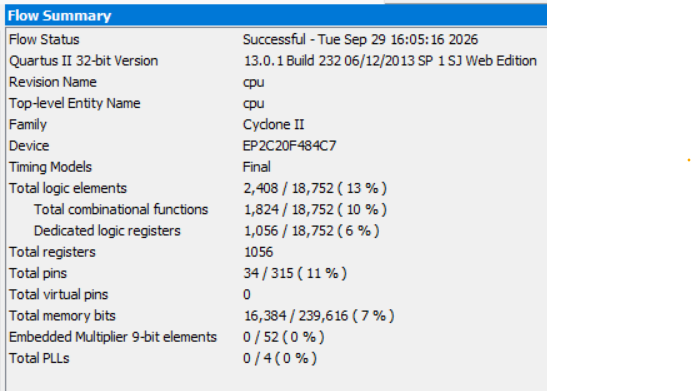
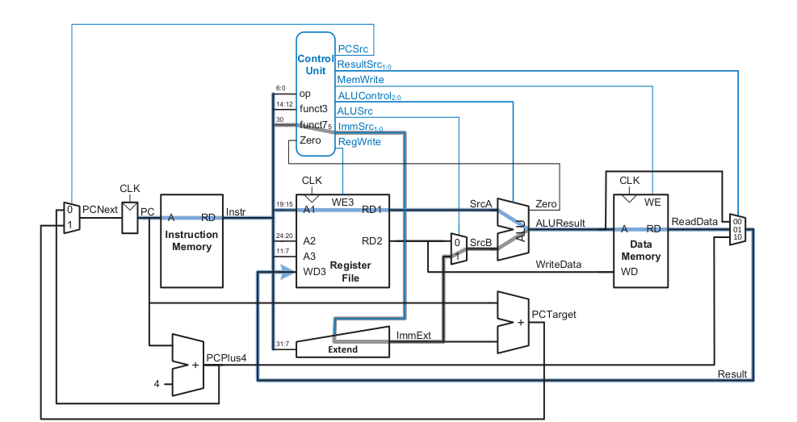
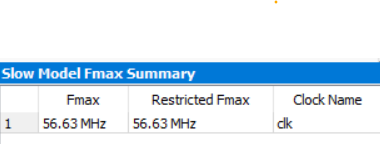

# RISC-V RV32I Single-Cycle Processor

A clean, modular implementation of a 32-bit single-cycle RISC-V processor core supporting the base integer instruction set ($\text{RV32I}$), developed in SystemVerilog.

> *Note: The core architecture and datapath design have been adapted from **Digital Design and Computer Architecture: RISC-V Edition** by David Harris and Sarah Harris.*

## 🏛️ System Architecture

This core implements a classic single-cycle datapath where every instruction executes within a single clock cycle. It integrates core functional units including an Arithmetic Logic Unit ($\text{ALU}$), a Register File ($32 \times 32$-bit registers), Instruction and Data Memories, an Immediate Extender, and a dedicated Control Unit.

### Processor Block Diagram


### Control Unit Logic


## 🚀 Getting Started & Usage Guide

Follow these steps to compile software, run simulations, and inspect waveforms for your processor design.

### 1. Compiling Assembly Code (`Makefile`)

The repository includes an automated `Makefile` to handle the software toolchain. It takes your raw assembly source file (`sw/asm/test.s`), compiles it using the GNU RISC-V cross-compiler, and converts it into a hex-formatted memory file (`.dat`) that is loaded into `rtl/single_cycle/memory/instruction_memory.sv`.

* **Source File:** `sw/asm/test.s`
* **Target Output:** `rtl/single_cycle/memory/test.dat`

To build the software program, simply run:
```bash
make
```


### 2. Running Simulations (`run.bat`)

Once the memory file is generated, you can run the hardware simulation testbench located in `tb/cpu_tb`.

Execute the simulation script via Windows Command Prompt or PowerShell:
```cmd
run.bat
```

This batch script compiles the RTL and testbench files, executes the simulation, generates a VCD (`wave.vcd`) file, and logs cycle-by-cycle hardware execution states to the console, showing what each instruction does on every clock edge.


## ⚙️ Synthesis & FPGA Deployment (DE1 Evaluation Board)

The core was targeted and synthesized for the **Intel/Altera DE1 FPGA Evaluation Board** (Cyclone II EP2C20F484C7) using **Intel Quartus Prime**.

### Key Synthesis Takeaways & Hardware Optimizations

1. **Top-Level Pin Preservation:**
   * During early synthesis runs, Quartus pruned large sections of the logic because there wasn't output pins.
   * To prevent the synthesizer from optimizing away core functional units, outputing the instruction signal was the fix.

2. **Memory Block Optimization (MegaWizard IP):**
   * Synthesizing raw SystemVerilog array structures for instruction and data memory resulted in Quartus instantiating thousands of individual **Logic Elements (LEs)** as flip-flops rather than utilizing the FPGA's dedicated **M4K embedded memory blocks**.
   * To achieve efficient resource utilization, both Instruction Memory and Data Memory were migrated to **Altera MegaWizard (IP Catalog) RAM/ROM blocks** . This dropped LE consumption significantly and properly utilized the onboard hardware memory bits.

### 📊 Synthesis Resource Utilization Summary

After applying block memory IPs and routing top-level outputs, the Quartus synthesis report confirmed expected hardware bit utilization for instruction and data storage:

### Flow Summary


The RV32I architecture requires separate memory spaces for instruction fetching and data storage:

* **Instruction Memory:** $256 \text{ words} \times 32 \text{ bits} = 8,192 \text{ bits}$ ($1\text{ KB}$)
* **Data Memory:** $256 \text{ words} \times 32 \text{ bits} = 8,192 \text{ bits}$ ($1\text{ KB}$)

When inferred as behavioral SystemVerilog arrays, Quartus maps these $16,384$ memory cells to individual **Logic Elements (LEs)**, consuming thousands of LE flip-flops and routing resources.


## ⏱️ Critical Path & Timing Analysis (Quartus TimeQuest)

In a single-cycle RISC-V processor, the clock period is constrained by the worst-case propagation delay through the longest structural path in the datapath—the **Critical Path**. Every instruction must complete execution through this entire hardware path within a single clock cycle.

### 🛑 Critical Path Analysis (`lw` Instruction)



The critical path occurs during the execution of the Load Word (`lw`) instruction because it traverses the maximum number of sequential and combinational logic blocks back-to-back:

1. **Program Counter (PC):** Clock-to-output delay ($T_{pc\_q}$) to present the current instruction address.
2. **Instruction Memory:** Address setup and lookup delay ($T_{imem}$) to fetch the 32-bit instruction word.
3. **Register File:** Read access time ($T_{rf\_read}$) to output operand data (`RD1`).
4. **ALU Input Multiplexer:** Mux propagation delay ($T_{mux}$) selecting between register data and immediate offset.
5. **Arithmetic Logic Unit (ALU):** Combinational execution time ($T_{alu}$) performing address addition (`SrcA + ImmExt`).
6. **Data Memory:** Memory access time ($T_{dmem}$) to read the word from RAM.
7. **Result Multiplexer:** Mux delay ($T_{mux}$) selecting memory `ReadData` as final result.
8. **Register File Setup:** Register file setup time ($T_{rf\_setup}$) before writing back to register `WD3` on the next rising clock edge.

$$\text{ $T\_{clock}$ } \ge T_{pc\_q} + T_{imem} + T_{rf\_read} + T_{mux} + T_{alu} + T_{dmem} + T_{mux} + T_{rf\_setup}$$

---

### 📈 Timing Results & Maximum Operating Frequency ($F_{max}$)

## 🔮 Future Improvements: 5-Stage Pipelined Architecture

While the single-cycle implementation guarantees that every instruction completes in one clock cycle ($\text{CPI} = 1$), its performance is fundamentally limited by the worst-case critical path delay ($lw$ instruction). To significantly increase the clock frequency ($F_{max}$) and improve overall **Instructions Per Second**, the architecture can be evolved into a **5-Stage Pipelined Processor**.

### 🏗️ Proposed Pipeline Stages

By breaking down the execution path into five smaller, balanced pipeline stages separated by intermediate pipeline registers (IF/ID, ID/EX, EX/MEM, MEM/WB), the critical path per clock cycle is reduced from the total combined delay down to the delay of a single stage:

1. **IF (Instruction Fetch):** Fetch instruction from Instruction Memory using the PC and update PC.
2. **ID (Instruction Decode):** Read operands from the Register File and decode control signals.
3. **EX (Execute):** Perform ALU calculations, address generation, or branch target evaluation.
4. **MEM (Memory Access):** Access Data Memory for `lw` and `sw` operations.
5. **WB (Write Back):** Write the result back to the Register File.